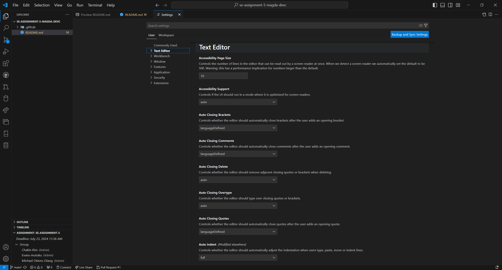
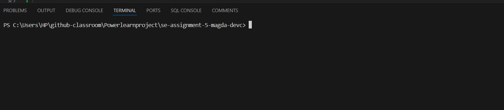
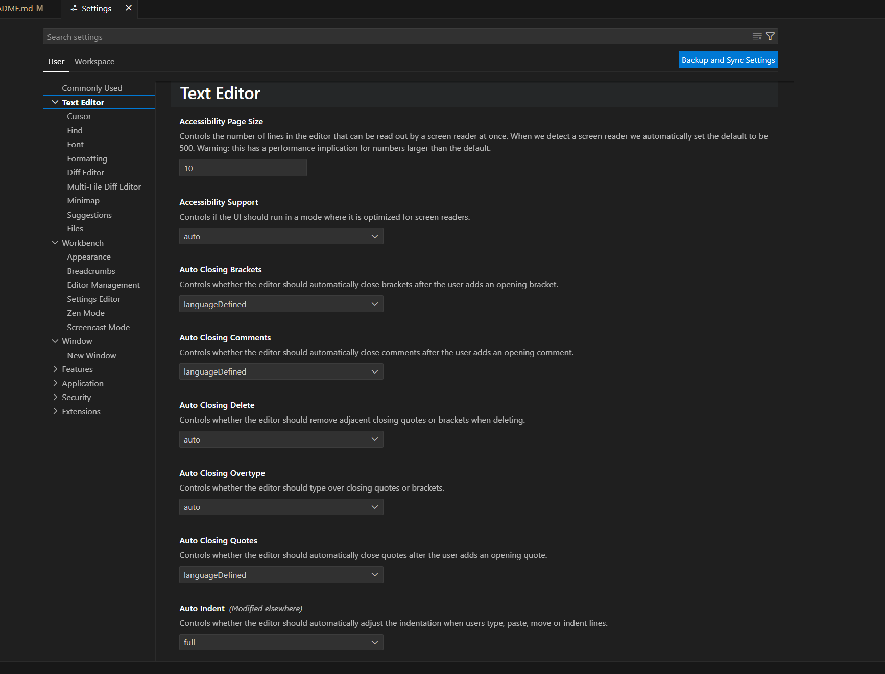

# SE-Assignment-5
Installation and Navigation of Visual Studio Code (VS Code)
 Instructions:
Answer the following questions based on your understanding of the installation and navigation of Visual Studio Code (VS Code). Provide detailed explanations and examples where appropriate.

 Questions:

1. Installation of VS Code:
   - Describe the steps to download and install Visual Studio Code on Windows 11 operating system. Include any prerequisites that might be needed.

   - Download VS Code. Go to the Visual Studio Code website.
   Click on the download button for Windows. This should download the installer.
   
   - Once the download is complete, run the installer by double-clicking the downloaded file
   - Follow Installation Steps. This involves choosing the installation location and confirming the installation.

2. First-time Setup:
   - After installing VS Code, what initial configurations and settings should be adjusted for an optimal coding environment? Mention any important settings or extensions.

   - Install support for your preffered programming language, change your keyboard shortcuts and easily migrate from other editors using keymap extensions.
   - Settings: Customize settings through File > Preferences > Settings. Or go directly to the icon at the bottom right of your screen in vs code. Examples: Change the theme
   adjust font size, page size, cursor blinking, and many more, installing necessary extensions such as vs-code fonts.
   

3. User Interface Overview:
   - Explain the main components of the VS Code user interface. Identify and describe the purpose of the Activity Bar, Side Bar, Editor Group, and Status Bar.

   - Activity Bar: Provides quick access to different views like Explorer, Source Control, Run and Debug, and Extensions.
   - Primary Side Bar: Contains views like Explorer (file explorer), Search (for finding text in files), Source Control (Git), Run and debug, and Extensions.
   - Editor: Workspace, Area where files are opened for editing. Multiple editor groups can be created for side-by-side editing.
   - Status Bar: Displays information about the current project and file, Git status, and optional features like language mode.
   

4. Command Palette:
   - What is the Command Palette in VS Code, and how can it be accessed? Provide examples of common tasks that can be performed using the Command Palette.
   
   - Command palette is to provides access to many commands. It is accessible via View > Command Palette or by pressing Ctrl+Shift+P.
   - Examples of tasks: Opening files, Running tasks, Changing the syntax highlighting, adding to folder, create new file, copy to editor, delete, debug and many more.

5. Extensions in VS Code:
   - Discuss the role of extensions in VS Code. How can users find, install, and manage extensions? Provide examples of essential extensions for web development.

   - The role of extensions is to enhance functionality (e.g; language support, debugging, themes).
   - The extensions is found in Setting then extensions or in the Activity Bar or using the command Ctrl+Shift+X. Search for the extensions you are iterested in and click the install button next to it.
   - Managing: You should be able to enable, disable, update extensions as needed by clicking the buttons in the specific extension.
   
   - Examples for web development: Live Serverto launch a development server with live reload capability, Prettier for Code linting and formatting for JavaScript, debugger for Chrome for debugging support for a programming language in Chrome.
   - Example of extensions: ESLint for JavaScript linting, Live Server for live preview of web pages, GitLens for Git integration.

6. Integrated Terminal:
   - Describe how to open and use the integrated terminal in VS Code. What are the advantages of using the integrated terminal compared to an external terminal?

   - You can open the terminal using View > Terminal or using the keyboard shortcut Ctrl+` , To create a new terminal, use the Ctrl+Shift+' . You can use the terminal to run a selected text, finding commands and provides integration with the editor to support features like links and error detection.
   
   - Advantages: Keeping workflow within VS Code, retains context of the workspace.

7. File and Folder Management:
   - Explain how to create, open, and manage files and folders in VS Code. How can users navigate between different files and directories efficiently?

   - Creating and opening: Use Explorer (Ctrl+Shift+E) to create a new file or the small icons next to the name of a folder to open, and manage files/folders.
   - Navigation: Click on files/folders in Explorer or use Ctrl+P to quickly navigate to files.

8. Settings and Preferences:
   - Where can users find and customize settings in VS Code? Provide examples of how to change the theme, font size, and keybindings.

   - You can find settings in File > Preferences > Settings and customize them to your preference.
   
   - Examples:
      - Change theme: Search for workbench: Appearance, color theme.
      - Adjust font size: Search for editor: font size.
      - Configure keybindings: Search for keybindings.

9. Debugging in VS Code:
   - Outline the steps to set up and start debugging a simple program in VS Code. What are some key debugging features available in VS Code?
   
   - Configure a launch configuration (launch.json) for your project.
   - Use Run > Start Debugging or press F5 to begin debugging.
   - Key debugging features: Breakpoints, step-through debugging, variable inspection (Watch and Variables views).

10. Using Source Control:
    - How can users integrate Git with VS Code for version control? Describe the process of initializing a repository, making commits, and pushing changes to GitHub.

   - First, ensure Git is installed on your system. Then, open VS Code, go to the Extensions, search for "Git", and install the official Git extension provided by Visual Studio Code.
   - Initialize a Git Repository: Initialize a New Repository from github. Open VS Code then the folder where you want to create a new Git repository. Click on the Source Control view icon in the sidebar to open the Source Control panel. Click on the "Initialize Repository" button or run git init from the Command Palette.
   - Make Commits: Open the file you want to change, make your changes and save the file. Go to source control, you'll see your changed files listed under "Changes". Enter a commit message in the text box at the top. Click the checkmark icon to commit the changes.
   - Push Changes to GitHub. Ensure you have the right GitHub repository link. In VS Code, open the Command Palette and type Git: Push. Select the remote repository where you want to push your changes. And VS Code will push your changes to GitHub.

 Submission Guidelines:
- Your answers should be well-structured, concise, and to the point.
- Provide screenshots or step-by-step instructions where applicable.
- Cite any references or sources you use in your answers.
- Submit your completed assignment by 1st July 

